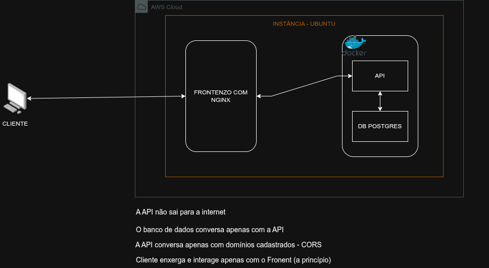

<!--  -->
# 🌐 User Manager Frontend

Interface web para consumo da API de gerenciamento de usuários.

Este projeto fornece uma interface simples e funcional para autenticação, visualização e gerenciamento de usuários, integrada à API backend.

---

## 📌 Sobre o Projeto

O frontend foi desenvolvido com foco em simplicidade e aprendizado, utilizando tecnologias web básicas.

Ele consome a API do projeto:

👉 [user-manager-api](https://github.com/luiz-oberto/user-manager-api)

---

## 🧱 Tecnologias Utilizadas

* HTML5  
* CSS3  
* Bootstrap 5  
* JavaScript (Vanilla)  
* Nginx (Reverse Proxy)  
* Docker (Backend)  
* PostgreSQL  
* HTTPS com Let's Encrypt  
* AWS EC2  

---
## 🧩 Arquitetura do Sistema

O sistema segue um modelo de arquitetura baseado em **proxy reverso**, com isolamento de serviços.

```text
Client (Browser)
      ↓ HTTPS (443)
Nginx (Reverse Proxy)
      ↓ HTTP (internal)
FastAPI (Docker)
      ↓
PostgreSQL

```

## 🔐 Características da arquitetura:
* O frontend é servido via Nginx
* A API não é exposta diretamente à internet
* O banco de dados é acessível apenas pela API
* Comunicação externa criptografada via HTTPS
* Comunicação interna isolada (rede local)

## 🖼️ Página de Arquitetura

O sistema possui uma página dedicada à visualização da arquitetura:

👉 **architecture.html**

Essa página apresenta:

* Diagrama da arquitetura
* Tecnologias utilizadas
* Fluxo da aplicação
* Camadas de segurança

## 🔐 Segurança Implementada
* 🔒 HTTPS com certificado válido (Let's Encrypt)
* 🔁 Redirecionamento automático HTTP → HTTPS
* 🛡️ API protegida atrás de proxy reverso (Nginx)
* 🔐 Autenticação via JWT
* 🚫 API não exposta diretamente
* 🗄️ Banco de dados isolado
* 🌐 CORS restrito (backend)

## 🔐 Funcionalidades

### 👤 Usuário comum

* Login no sistema
* Visualização do próprio perfil
* Logout

### 👑 Superusuário

* Login no sistema
* Acesso ao dashboard
* Listagem de usuários
* Criação de novos usuários
* Edição de usuários
* Exclusão de usuários

---

## 🔐 Autenticação

* Autenticação baseada em JWT
* Token armazenado no `localStorage`
* Envio automático via header:

```id="4i5nkm"
Authorization: Bearer TOKEN
```

---

## 📂 Estrutura do Projeto

```id="yz7dpu"
frontend/
│
├── index.html        # Login
├── dashboard.html    # Dashboard (admin)
├── profile.html      # Perfil do usuário
├── create.html       # Criar usuário
├── edit.html         # Editar usuário
├── architecture.html   # Página de arquitetura
│
├── js/
│   ├── api.js        # Configuração da API
│   ├── auth.js       # Login e autenticação
│   ├── auth-utils.js # Resgata o token se sessão
│   ├── dashboard.js  # Lógica do dashboard
│   ├── profile.js    # Perfil do usuário
│   ├── alerts.js     # Mensagens e alertas
│   ├── layout.js     # layout de menus via js
│   └── user.js       # CRUD de usuários
│
└── css/
```

---

## ⚙️ Configuração

### 🔹 API (IMPORTANTE)

No arquivo `js/api.js`, configure:

```javascript id="izptbw"
const API_URL = "/api";
```
O Nginx é responsável por redirecionar:

```bash
/api → http://127.0.0.1:8000
```

se precisar testar a API em ambiente de teste basta utilizar:
```javascript id="izptbw"
const API_URL = "http://IP_API:8000";
```
---

## 🧪 Execução do Projeto

### Rodar localmente:

```bash id="tny9p2"
cd user-manager-frontend
python3 -m http.server 5500
```

Acessar:

```id="u8n0kq"
http://localhost:5500
```
---
## 🚀 Deploy (Produção)

O sistema foi projetado para rodar com:

* Nginx servindo frontend
* Proxy reverso para API
* HTTPS com Let's Encrypt

### 🔹 Fluxo real:
```
Client → HTTPS → Nginx → API interna → Banco
```

---

## 🔐 Controle de Acesso

O sistema implementa controle de acesso no frontend:

* Verificação de autenticação (`checkAuth`)
* Verificação de permissões (`is_superuser`)
* Redirecionamento automático após login
* Bloqueio de páginas restritas
* Renderização condicional de elementos

---

## 🔄 Fluxo de Navegação

```id="zpp8z7"
Login
  ↓
Verificação de perfil
  ↓
├── Admin → Dashboard
└── Usuário → Perfil
```

---

## ⚠️ CORS
No backend
```python id="2d4g6p"
allow_origins=["https://usermanager.servehttp.com"]
```

Durante o desenvolvimento, a API deve permitir requisições externas (CORS):

```python id="2d4g6p"
allow_origins=["*"]
```

> Em produção, recomenda-se restringir os domínios.

---

## 🧠 Padrões Utilizados

* Separação de responsabilidades (JS por página)
* Inicialização controlada (`initPage`)
* Proteção de rotas no frontend
* Consumo de API via Fetch
* Uso de proxy reverso (Nginx)
* Isolamento de serviços
* Arquitetura baseada em camadas

---

## 🎯 Melhorias Futuras

* 🔐 Implementar HSTS
* 🛡️ Content Security Policy (CSP)
* ⚡ Rate limiting no Nginx
* 📊 Paginação e busca no dashboard
* 🔄 Refresh token
* 📱 Melhor responsividade
* 📈 Monitoramento e logs

---

## 🔗 Integração com Backend

Este frontend depende da API:

👉 [user-manager-api](https://github.com/luiz-oberto/user-manager-api)

Certifique-se de que a API esteja rodando antes de utilizar o sistema.

---

## 📄 Licença

Projeto acadêmico com evolução para arquitetura de produção.

---

## 👨‍💻 Autor
Desenvolvido por Luiz Oberto Matos Raiol

Analista de TI com foco em Backend e Segurança da Informação.
Experiência em desenvolvimento de APIs, automação e infraestrutura.

Projeto desenvolvido para aprendizado de:

* Integração frontend/backend
* Controle de acesso
* Consumo de APIs REST
* APIs REST (FastAPI)
* Infraestrutura (AWS, Nginx, Docker)
* Autenticação e segurança (JWT, HTTPS)
* Arquitetura de sistemas

🔗 LinkedIn: https://www.linkedin.com/in/luiz-oberto-matos-raiol-217038283/

🔗 GitHub: https://github.com/luiz-oberto